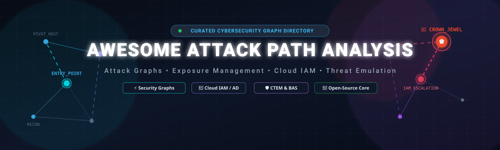

<p align="center">
  
</p>

<p align="center">
  <a href="https://github.com/ishandutta2007/Awesome-Awesome-Awesome"></a><a href="https://discord.gg/jc4xtF58Ve"></a>
  <a href="https://awesome.re"></a>
  <a href="https://github.com/ishandutta2007/Awesome-Attack-Path-Analysis/stargazers"></a>
  <a href="https://github.com/ishandutta2007/Awesome-Attack-Path-Analysis/forks"></a>
  <a href="https://github.com/ishandutta2007/Awesome-Attack-Path-Analysis/graphs/commit-activity"></a>
  <a href="LICENSE"></a>
  <a href="http://makeapullrequest.com"></a>
</p>

---

# 🚀 Awesome Attack Path Analysis & Exposure Management

> ⚡ **A curated directory of Attack Path Analysis (APA), Attack Graph Reasoning, Continuous Threat Exposure Management (CTEM), Security Knowledge Graphs, Cloud IAM Privilege Escalation, and Breach & Attack Simulation (BAS) platforms.**

**Attack Path Analysis (APA)** is a proactive cybersecurity discipline that computes how diverse vulnerabilities, excessive cloud/identity privileges, misconfigurations, and network reachability can be chained together by an adversary to compromise high-value assets ("Crown Jewels"). By organizing enterprise telemetry into connected graph topologies, security teams can pinpoint **choke points** and eliminate hundreds of attack routes with a single targeted remediation.

---

## 📑 Table of Contents

- [🎯 Core Concepts & Taxonomy](#-core-concepts--taxonomy)
- [🏢 Enterprise SaaS & Hosted Platforms](#-enterprise-saas--hosted-platforms)
- [🧑‍💻 Open-Source Platforms & Tools](#-open-source-platforms--tools)
- [🔥 Top Open-Source Picks by Category](#-top-open-source-picks-by-category)
- [🧩 Attack Path Analysis Architecture Stack](#-attack-path-analysis-architecture-stack)
- [📚 Technical Articles & Academic Foundations](#-technical-articles--academic-foundations)
- [🤝 Contributing & Community](#-contributing--community)

---

## 🎯 Core Concepts & Taxonomy

| Term | Acronym | Description |
|---|---|---|
| **Attack Path Analysis** | APA | Algorithmic exploration of multi-stage attack vectors from untrusted initial access to critical enterprise assets. |
| **Attack Graph** | AG | A mathematical directed graph $G = (V, E)$ where vertices $V$ represent system states or privileges and edges $E$ represent exploit transitions. |
| **Continuous Threat Exposure Management** | CTEM | Gartner framework for scoping, discovering, prioritizing, validating, and mobilizing remediation across hybrid environments. |
| **Cloud Infrastructure Entitlement Management** | CIEM | Graph-driven analysis of excessive, unused, or cross-account permissions in AWS, Azure, GCP, and Kubernetes. |
| **Breach & Attack Simulation** | BAS | Automated execution of synthetic adversary techniques to validate whether defensive controls detect or block attack paths. |
| **Choke Point** | — | A critical node or edge in an attack graph through which multiple viable attack routes must pass; ideal for high-leverage remediation. |

---
## 🏢 Enterprise SaaS & Hosted Platforms

> Sorted in **descending order** by company scale (market capitalization, enterprise valuation, or annual revenue). All pricing figures indicate verified starting-tier list prices or cloud marketplace entry tiers.

| Platform | Company Scale (Valuation / Revenue) | Description | Primary Focus | Pricing (Starting Tier) | Free Tier / Trial Limit |
|---|---|---|---|---|---|
| 🏢 **[Microsoft Security Exposure Management](https://www.microsoft.com/en-us/security/business/security-exposure-management)** | **~$3.10T** Market Cap / **$245B+** Rev | Enterprise exposure management combining asset graph exploration, attack path mapping, and security posture across hybrid IT. | Exposure Management & Attack Paths | Core exposure graph included in Defender for Endpoint Plan 2 ($5.20/user/mo) or Defender for Cloud ($5.00/server/mo) | 🎁 **30-day free trial** for up to 250 user licenses or 50 cloud servers |
| 🌐 **[Microsoft Defender EASM](https://www.microsoft.com/en-us/security/business/threat-protection/microsoft-defender-external-attack-surface-management)** | **~$3.10T** Market Cap / **$245B+** Rev | External attack surface discovery uncovering internet-exposed assets, Shadow IT, and external entry attack vectors. | External Attack Surface (EASM) | **$0.011** per monitored asset/day (~$4.01/asset/year on Azure Marketplace) | 🎁 **30-day free trial** on Azure for up to 1,000 discovered external assets |
| 🛡️ **[Mandiant Advantage (Google Cloud)](https://cloud.google.com/security/mandiant)** | **~$2.10T** Market Cap (Alphabet) / **$307B+** Rev | Threat intelligence and attack surface management correlating frontline adversary intelligence with external asset exposures. | Threat Intelligence & ASM | **$15,000/year** base Attack Surface Management starter tier on AWS/GCP Marketplace | 🎁 **Free Community Edition** (10 daily threat searches) or **30-day** enterprise ASM trial |
| 🎯 **[IBM Security Randori](https://www.randori.com/)** | **~$200B+** Market Cap / **$62B+** Rev | Adversary-perspective attack surface management and automated red teaming discovering internet-facing attack chains. | Attack Surface & Adversary Recon | **$11,760/year** (£762/mo starting instance base tier; ~$15,000/yr AWS tier) | 🎁 **7-day free trial** Attack Surface Assessment for up to 100 external domains |
| ⚡ **[Palo Alto Networks Cortex XSIAM](https://www.paloaltonetworks.com/cortex/cortex-xsiam)** | **~$110B+** Market Cap / **$8.0B+** Rev | AI-driven autonomous security operations platform unifying SIEM, XDR, SOAR, and attack graph exposure correlation. | XDR & Autonomous SecOps | **$100,000/year** minimum platform commitment (100 GB/day ingestion tier @ ~$2.50/GB/day) | 🎁 **30-day guided Proof of Concept (POC)** for up to 500 enterprise endpoints |
| ☁️ **[Palo Alto Networks Prisma Cloud](https://www.paloaltonetworks.com/prisma/cloud)** | **~$110B+** Market Cap / **$8.0B+** Rev | Comprehensive CNAPP mapping cloud misconfigurations, IAM entitlements, vulnerabilities, and multi-cloud attack paths. | Cloud Security & CIEM | **$9,000/year** base Business Edition tier (100-credit pack @ $90/credit/yr on AWS) | 🎁 **30-day free trial** for up to 50 cloud workloads (VMs, containers, lambdas) |
| 🦅 **[CrowdStrike Falcon Exposure Management](https://www.crowdstrike.com/)** | **~$85B+** Market Cap / **$3.0B+** Rev | Unified exposure management combining endpoint vulnerability data, identity risk, asset graphs, and active adversary threat intelligence. | Exposure Management & XDR | **$85.00/endpoint/year** (£65/endpoint/yr list price; Falcon Enterprise @ $184.99/endpoint/yr) | 🎁 **15-day free trial** for up to 100 endpoints with full exposure & identity tools |
| 🪄 **[Wiz](https://www.wiz.io/)** | **$12.0B** Valuation / **$500M+** ARR | Cloud security platform using the Wiz Security Graph to visualize interconnected risks, IAM paths, and toxic cloud combinations. | Cloud Attack Paths & CNAPP | **$12,000/year** base starter package on AWS Marketplace (covers up to 50 compute instances) | 🎁 **14-day Proof of Value (PoV) trial** for up to 250 cloud workloads |
| 🛡️ **[SentinelOne Singularity Exposure Management](https://www.sentinelone.com/)** | **~$7.5B** Market Cap / **$621M+** Rev | Endpoint, identity, and network attack path visibility linking unmanaged device discovery (Ranger) with vulnerability prioritization. | Exposure Management & EDR | **$69.00/agent/year** (Singularity Core; Singularity Complete + Ranger starts at $150/agent/yr) | 🎁 **30-day free trial** for up to 100 endpoints across Windows, macOS, and Linux |
| 🎯 **[Tenable One](https://www.tenable.com/products/tenable-one)** | **~$5.2B** Market Cap / **$800M+** Rev | Exposure management platform unifying vulnerability management, Active Directory security, cloud posture, and attack path graph analytics. | Exposure Management & Attack Paths | **$3,500/year** base Foundation pack (100 assets @ $35/asset/year on AWS Marketplace) | 🎁 **30-day free trial** for up to 65 enterprise assets across IT, cloud, and AD |
| 🤖 **[Tenable ExposureAI](https://www.tenable.com/)** | **~$5.2B** Market Cap / **$800M+** Rev | Generative AI and graph-powered exposure summarization and attack path query system within the Tenable One ecosystem. | AI Exposure Prioritization | Included in **Tenable One** starting at **$3,500/year** (100-asset baseline) | 🎁 **30-day full platform trial** as part of the Tenable One evaluation program |
| 🔑 **[Ermetic / Tenable Cloud Security](https://www.tenable.com/products/tenable-cloud-security)** | **~$5.2B** Market Cap (Tenable) | Identity-first cloud infrastructure entitlement management (CIEM) and attack path engine analyzing toxic cloud permission chains. | Cloud IAM & Entitlements | **$6,000/year** entry subscription (covers up to 50 cloud compute/IAM resources) | 🎁 **14-day free trial** for up to 100 cloud accounts and IAM identity entitlement mapping |
| ☁️ **[Qualys TotalCloud](https://www.qualys.com/)** | **~$5.0B** Market Cap / **$554M+** Rev | Cloud-native posture and exposure platform correlating container vulnerabilities, cloud permissions, and exploitable attack paths. | Cloud Exposure & VMDR | **$3,295/year** (VMDR Express for up to 32 IP assets; TotalCloud base starts at $4,000/yr) | 🎁 **30-day free trial** for up to 16 IP assets or 50 cloud resources |
| 🔍 **[Recorded Future](https://www.recordedfuture.com/)** | **$2.65B** Valuation (Mastercard) / **$300M+** ARR | Threat intelligence graph linking threat actors, malware signatures, CVEs, and enterprise external attack surface exposures. | Threat Intelligence & Graph | **$20,000/year** base module starting tier on AWS Marketplace | 🎁 **Free Cyber Daily newsletter** + **14-day** SecOps intelligence portal trial |
| 📊 **[Rapid7 Exposure Command](https://www.rapid7.com/)** | **~$2.6B** Market Cap / **$777M+** Rev | Exposure management and attack surface tracking correlating InsightVM vulnerability context, active exploits, and identity paths. | Vulnerability & Exposure Command | **$2,185/year** (InsightVM starter tier for 100 assets @ $21.85/asset/yr; Exposure Command add-on starts at $5,000/yr) | 🎁 **30-day free trial** for up to 256 assets with full live attack path scanning |
| 🐳 **[Orca Security](https://orca.security/)** | **$1.8B** Valuation / **$100M+** ARR | Agentless SideScanning platform building a 100% unified cloud graph to uncover attack routes across compute, identities, and data. | Agentless Cloud Attack Paths | **$10,000/year** base starter package on AWS Marketplace (covers up to 50 cloud assets) | 🎁 **14-day free trial** for up to 100 cloud assets across AWS, Azure, and GCP |
| ⚔️ **[Pentera](https://pentera.io/)** | **$1.0B** Valuation (Unicorn) / **$50M+** ARR | Automated security validation platform that safely exploits live vulnerabilities and credential leaks to validate dynamic attack chains. | Automated Security Validation | **$35,000/year** starting base license (covers up to 500 internal/external IP nodes) | 🎁 **14-day Proof of Concept (POC)** validation test (up to 1 live attack campaign) |
| 🌐 **[CyCognito](https://www.cycognito.com/)** | **$800M** Valuation / **$35M+** ARR | Autonomous external attack surface management identifying unknown shadow assets, subsidiary assets, and path exposures. | External Attack Surface (EASM) | **$30,000/year** base starter tier on AWS Marketplace (ASM 250 tier for up to 250 assets) | 🎁 **14-day external attack surface trial** for up to 250 public domain assets |
| 🕸️ **[XM Cyber](https://xmcyber.com/)** | **$700M** (Schwarz Group) / **$40M+** ARR | Continuous exposure management platform modeling end-to-end hybrid attack graphs to pinpoint critical choke points. | Attack Path & Exposure Graph | **$15,000/year** base subscription on AWS Marketplace (covers up to 250 monitored nodes) | 🎁 **14-day Proof of Value (PoV) trial** for up to 250 endpoints and hybrid identities |
| 🔄 **[AlgoSec](https://www.algosec.com/)** | **~$500M** Valuation / **$80M+** Rev | Network security policy management and connectivity mapping analyzing firewall rules and network attack reachability. | Network Path & Firewall Graph | **$3,000/year** base tier on AWS/Azure Marketplace (covers 100 workloads / $3,200/firewall/yr) | 🎁 **30-day free trial** for up to 5 security devices and 25 firewall rules |
| 🔥 **[FireMon](https://www.firemon.com/)** | **~$400M** Valuation / **$70M+** Rev | Real-time network security policy management, compliance auditing, and attack path simulation across hybrid network topologies. | Network Security Policy & Paths | **$7,200/year** base tier (covers up to 5 network security devices; Asset Manager free on AWS) | 🎁 **30-day free trial evaluation** for up to 5 firewall devices and policy maps |
| 🎭 **[Cymulate](https://cymulate.com/)** | **~$350M** Valuation / **$30M+** ARR | Extended Security Posture Management (XSPM) and BAS platform validating defensive controls across email, web, and lateral movement. | BAS & Exposure Validation | **$13,000/year** starting tier on AWS Marketplace (covers 2 simulation attack vectors) | 🎁 **14-day free trial** covering 2 core vectors (Email & Web Gateway validation) |
| 🔐 **[Pathlock](https://pathlock.com/)** | **~$300M** Valuation / **$40M+** Rev | Application access governance and segregation of duties (SoD) platform identifying toxic combinations in SAP, Oracle, and Salesforce. | ERP & Identity Access Risk | **$12,000/year** entry starter subscription (covers up to 250 ERP/IAM user identities) | 🎁 **14-day Access Risk Assessment trial** for 1 enterprise ERP system |
| 🧠 **[ThreatConnect](https://threatconnect.com/)** | **~$250M** Valuation / **$35M+** Rev | Threat intelligence platform (TIP) and cyber risk quantification engine modeling adversary relationships and attack vectors. | Threat Intelligence & Graph | **$40,000/year** base TIP module starting tier on GSA / AWS Marketplace | 🎁 **Free Community Edition** (threat sharing) or **14-day** enterprise trial |
| 🛡️ **[SafeBreach](https://www.safebreach.com/)** | **~$250M** Valuation / **$25M+** Rev | Breach and attack simulation platform executing thousands of attack playbooks against MITRE ATT&CK to uncover exploitable paths. | BAS & Attack Validation | **$50,000/year** starter tier on AWS Marketplace (covers up to 5 simulator endpoints) | 🎁 **14-day Proof of Concept (POC)** trial with up to 5 simulator endpoints |
| 📐 **[Brinqa](https://www.brinqa.com/)** | **~$200M** Valuation / **$20M+** Rev | Cyber risk orchestration platform powered by the Cyber Risk Graph connecting assets, vulnerabilities, threats, and business criticality. | Cyber Knowledge Graph | **$24,000/year** entry starter bundle (Cyber Risk Graph for up to 1,000 assets) | 🎁 **30-day Proof of Value (PoV)** evaluation for up to 500 unified IT/cloud assets |
| 📈 **[Balbix](https://www.balbix.com/)** | **~$150M** Valuation / **$15M+** ARR | AI-powered cyber risk posture and vulnerability management computing multi-factor risk scores and attack surface vectors. | AI Cyber Risk & Attack Surface | **$12,000/year** base tier on AWS Marketplace (covers up to 500 monitored assets) | 🎁 **30-day Cyber Risk Assessment trial** for up to 250 enterprise assets |
| 🧩 **[Sonrai Security](https://sonraisecurity.com/)** | **~$150M** Valuation / **$15M+** ARR | Cloud permissions firewall and CIEM platform uncovering identity privilege escalation paths and sensitive data access routes. | Cloud Identity & CIEM | **$10,000/year** starter tier on AWS/Azure Marketplace (covers up to 100 cloud identities) | 🎁 **14-day Cloud Permissions Firewall trial** for up to 5 cloud accounts |
| 🎯 **[Picus Security](https://www.picussecurity.com/)** | **~$120M** Valuation / **$15M+** Rev | Security validation platform simulating continuous cyber threats across network perimeters, email, and endpoints. | BAS & Defense Validation | **$30,000/year** base subscription on AWS Marketplace (up to 3 validation peer agents) | 🎁 **14-day Security Control Validation trial** for up to 2 network segments |
| 🕵️ **[Permiso Security](https://permiso.io/)** | **~$100M** Valuation / **$10M+** ARR | Cloud identity detection and response (ITDR) mapping runtime human and non-human identities, credentials, and pivot paths. | Cloud Identity & ITDR | **$12,000/year** base starter pack (covers up to 50 cloud identities/workloads) | 🎁 **14-day Cloud Identity Detection trial** for up to 10 cloud accounts |

---
## 🧑‍💻 Open-Source Platforms & Tools

> Sorted in **descending order by GitHub star count**. Star badges link directly to the repository stargazers page.

| Project & Repo | Description | Primary Category |
|---|---|---|
| 🔍 **[Nmap](https://github.com/nmap/nmap)** [](https://github.com/nmap/nmap/stargazers) | Industry-standard network exploration tool and security scanner supplying network topology and port reachability for attack graph modeling. | Network Topology Discovery |
| 🛡️ **[Trivy](https://github.com/aquasecurity/trivy)** [](https://github.com/aquasecurity/trivy/stargazers) | Comprehensive vulnerability, secret, misconfiguration, and SBOM scanner for containers, Kubernetes, cloud, and code repositories. | Vulnerability & Container Scanning |
| ⚡ **[Nuclei](https://github.com/projectdiscovery/nuclei)** [](https://github.com/projectdiscovery/nuclei/stargazers) | Fast and highly extensible vulnerability scanner based on simple YAML templates for automated detection of exploitable vulnerabilities. | Exposure & Vulnerability Discovery |
| 📊 **[Neo4j](https://github.com/neo4j/neo4j)** [](https://github.com/neo4j/neo4j/stargazers) | The premier open-source native graph database engine used as the underlying storage and Cypher query layer for modern attack graphs. | Graph Database Engine |
| 🐍 **[NetworkX](https://github.com/networkx/networkx)** [](https://github.com/networkx/networkx/stargazers) | High-performance Python package for creating, manipulating, and studying the structure, shortest paths, centrality, and dynamics of complex attack networks. | Graph Algorithms & Analysis |
| ☁️ **[Prowler](https://github.com/prowler-cloud/prowler)** [](https://github.com/prowler-cloud/prowler/stargazers) | Open-source multi-cloud security assessment, posture management (CSPM), and compliance tool for AWS, Azure, GCP, and Kubernetes. | Cloud Security & Compliance |
| 🔬 **[Semgrep](https://github.com/semgrep/semgrep)** [](https://github.com/semgrep/semgrep/stargazers) | Fast, open-source static analysis engine for finding code vulnerabilities, enforcing secure defaults, and tracing taint reachability paths. | Code-Level Reachability & SAST |
| 🩸 **[BloodHound Community Edition](https://github.com/SpecterOps/BloodHound)** [](https://github.com/SpecterOps/BloodHound/stargazers) | Groundbreaking graph-theory security tool mapping relationships and attack paths across Active Directory, Azure/Entra ID, and cloud identities. | Identity & Active Directory Paths |
| 🧪 **[Atomic Red Team](https://github.com/redcanaryco/atomic-red-team)** [](https://github.com/redcanaryco/atomic-red-team/stargazers) | Library of simple, open-source, automated adversary technique tests mapped directly to the MITRE ATT&CK framework for path validation. | Adversary Emulation & BAS |
| 📜 **[Checkov](https://github.com/bridgecrewio/checkov)** [](https://github.com/bridgecrewio/checkov/stargazers) | Policy-as-code static analysis tool with graph-based framework scanning Terraform, CloudFormation, Kubernetes, and Helm for misconfigurations. | IaC Graph Security |
| ☸️ **[Kube-bench](https://github.com/aquasecurity/kube-bench)** [](https://github.com/aquasecurity/kube-bench/stargazers) | Checks whether Kubernetes is configured securely against the CIS Kubernetes Benchmark to identify cluster privilege escalation paths. | Kubernetes Security |
| 🌐 **[OpenCTI](https://github.com/OpenCTI-Platform/opencti)** [](https://github.com/OpenCTI-Platform/opencti/stargazers) | Open-source cyber threat intelligence platform structuring technical and non-technical threat data into rich GraphQL knowledge graphs. | Threat Intelligence Graph |
| 📡 **[MISP](https://github.com/MISP/MISP)** [](https://github.com/MISP/MISP/stargazers) | Open-source threat intelligence and sharing platform for correlating indicators, adversary campaigns, and threat relationships. | Threat Intelligence Graph |
| 🎭 **[MITRE Caldera](https://github.com/mitre/caldera)** [](https://github.com/mitre/caldera/stargazers) | Scalable, automated adversary emulation system built on MITRE ATT&CK for executing complex multi-stage attack chains and defensive validation. | Adversary Emulation |
| 🔌 **[Steampipe](https://github.com/turbot/steampipe)** [](https://github.com/turbot/steampipe/stargazers) | Open-source zero-ETL query engine to query cloud APIs, code, identity providers, and network assets as live relational SQL tables. | Security Data Ingestion |
| 🗺️ **[Cartography](https://github.com/lyft/cartography)** [](https://github.com/lyft/cartography/stargazers) | Python tool that consolidates infrastructure assets and identity relationships into a Neo4j graph database for attack surface mapping. | Security Graph Mapping |
| 🎯 **[Kube-hunter](https://github.com/aquasecurity/kube-hunter)** [](https://github.com/aquasecurity/kube-hunter/stargazers) | Hunts for security weaknesses and exploitable paths in Kubernetes clusters from both external attacker and internal pod vantage points. | Kubernetes Attack Vectors |
| ☁️ **[CloudMapper](https://github.com/duo-labs/cloudmapper)** [](https://github.com/duo-labs/cloudmapper/stargazers) | AWS visualization and security analysis tool for mapping cloud infrastructure topology, routing tables, and internet-exposed paths. | AWS Topology & Graph |
| 🐒 **[Infection Monkey](https://github.com/guardicore/monkey)** [](https://github.com/guardicore/monkey/stargazers) | Open-source breach-and-attack simulation platform that tests resilience against lateral movement, credential theft, and propagation. | Lateral Movement Simulation |
| 🔍 **[ScoutSuite](https://github.com/nccgroup/ScoutSuite)** [](https://github.com/nccgroup/ScoutSuite/stargazers) | Open-source multi-cloud security auditing tool querying cloud provider APIs to detect posture risks across AWS, Azure, GCP, and Alibaba. | Multi-Cloud Auditing |
| 🦙 **[Pacu](https://github.com/RhinoSecurityLabs/pacu)** [](https://github.com/RhinoSecurityLabs/pacu/stargazers) | Open-source AWS exploitation and privilege escalation framework designed to simulate offensive cloud attack paths and IAM misuse. | AWS IAM Attack Chains |
| 🛡️ **[OpenVAS / Greenbone](https://github.com/greenbone/openvas-scanner)** [](https://github.com/greenbone/openvas-scanner/stargazers) | Comprehensive open-source vulnerability scanning engine containing daily-updated network vulnerability feeds for attack graph feeds. | Vulnerability Scanner |
| 📊 **[DefectDojo](https://github.com/DefectDojo/django-DefectDojo)** [](https://github.com/DefectDojo/django-DefectDojo/stargazers) | Open-source vulnerability management and correlation platform aggregating security findings from 150+ scanners into unified risk views. | Vulnerability Orchestration |
| 🗺️ **[ThreatMapper](https://github.com/deepfence/ThreatMapper)** [](https://github.com/deepfence/ThreatMapper/stargazers) | Open-source cloud-native exposure management engine that discovers vulnerabilities, secrets, and generates contextual cloud attack graphs. | Cloud Attack Graph & CTEM |
| ☁️ **[CloudSploit](https://github.com/aquasecurity/cloudsploit)** [](https://github.com/aquasecurity/cloudsploit/stargazers) | Cloud security posture scanner evaluating AWS, Azure, GCP, and Oracle Cloud configurations for security exposures. | Cloud Posture Management |
| 📈 **[igraph](https://github.com/igraph/igraph)** [](https://github.com/igraph/igraph/stargazers) | Fast, high-performance graph computation library in C/Python/R suitable for large-scale enterprise network attack graph calculations. | Graph Computation Library |
| 🦊 **[CloudFox](https://github.com/BishopFox/cloudfox)** [](https://github.com/BishopFox/cloudfox/stargazers) | Situational-awareness command-line tool for penetration testers to enumerate cloud infrastructure and discover exploitable privilege vectors. | Cloud Attack Path Discovery |
| 🐉 **[OWASP Threat Dragon](https://github.com/OWASP/threat-dragon)** [](https://github.com/OWASP/threat-dragon/stargazers) | Open-source visual threat modeling web/desktop application for generating STRIDE diagrams and threat path mitigations. | Threat Modeling |
| 🔑 **[PMapper](https://github.com/nccgroup/PMapper)** [](https://github.com/nccgroup/PMapper/stargazers) | Advanced AWS IAM privilege escalation analysis tool that models IAM relationships and computes transitive privilege escalation paths. | AWS IAM Privilege Paths |
| 🐕 **[SharpHound](https://github.com/SpecterOps/SharpHound)** [](https://github.com/SpecterOps/SharpHound/stargazers) | Fast C# Active Directory relationship collector engineered to extract domain objects, ACLs, and trust relationships for BloodHound. | Active Directory Ingestion |
| 🐍 **[OWASP pytm](https://github.com/OWASP/pytm)** [](https://github.com/OWASP/pytm/stargazers) | Pythonic framework for threat modeling as code, programmatically defining systems, trust boundaries, data flows, and threats. | Threat Modeling as Code |
| 📊 **[Graphistry](https://github.com/graphistry/pygraphistry)** [](https://github.com/graphistry/pygraphistry/stargazers) | GPU-accelerated visual graph analytics library in Python for interactive exploration of massive cybersecurity knowledge graphs. | GPU Graph Visualization |
| 🧠 **[MulVAL](https://github.com/risksense/mulval)** [](https://github.com/risksense/mulval/stargazers) | Seminal logic-based multi-host multi-stage attack graph generation tool using Datalog reasoning on network configurations and CVEs. | Formal Attack Graph Engine |
| 🎮 **[Prelude Operator](https://github.com/preludeorg)** [](https://github.com/preludeorg/stargazers) | Developer-friendly security validation tool executing continuous autonomous attack techniques across enterprise infrastructure. | Adversary Emulation |
| 📐 **[Attack Graph Analysis](https://github.com/mmohamedkhaled/attack-graph-analysis)** [](https://github.com/mmohamedkhaled/attack-graph-analysis/stargazers) | Python toolkit implementing algorithmic models for attack-path ranking, CVSS score propagation, and minimum-cut optimization. | Attack Graph Algorithms |
| 🔬 **[CTS Analyzer](https://github.com/ncr-no/cts-analyzer)** [](https://github.com/ncr-no/cts-analyzer/stargazers) | Research platform combining MulVAL evidence paths, cyber threat scenario graphs, and cyber kill-chain analysis. | Kill-Chain & Path Analysis |

---

## 🔥 Top Open-Source Picks by Category

### 🥇 1. Best for Identity & Active Directory Attack Paths — [BloodHound CE](https://github.com/SpecterOps/BloodHound)
- **Why it leads:** Industry standard for graph-theoretic Active Directory and Azure / Entra ID attack analysis. Reveals hidden nested groups, unconstrained delegation, ACL abuse, and shortest routes to `Domain Admins`.
- **Top Ingestion Tools:** [SharpHound](https://github.com/SpecterOps/SharpHound) (On-prem AD), AzureHound (Entra ID).
- **Commercial Counterparts:** XM Cyber, Tenable One, Microsoft Security Exposure Management.

### 🥈 2. Best Formal Attack-Graph Engine — [MulVAL](https://github.com/risksense/mulval)
- **Why it leads:** Foundational academic and research framework performing logic-based multi-host vulnerability chaining using Datalog rules and CVE databases.
- **Best Use Case:** Formal vulnerability reachability modeling and automated enterprise network attack graph construction.

### 🥉 3. Best for Cloud Graph & Asset Relationships — [Cartography](https://github.com/lyft/cartography) & [ThreatMapper](https://github.com/deepfence/ThreatMapper)
- **Why it leads:** Cartography maps multi-cloud infrastructure (AWS, GCP, Azure, Kubernetes, Okta, GitHub) directly into Neo4j for expressive Cypher-based security queries. ThreatMapper provides an out-of-the-box UI for runtime container & cloud attack path discovery.

### 🔑 4. Best for AWS IAM Privilege Escalation — [PMapper](https://github.com/nccgroup/PMapper) & [Pacu](https://github.com/RhinoSecurityLabs/pacu)
- **Why it leads:** PMapper constructs a directed graph of IAM users, roles, and groups to compute transitivity in AssumeRole and IAM permissions, discovering subtle privilege escalations to `AdministratorAccess`.

### 🧪 5. Best for Adversary Technique & Lateral Movement Validation — [Atomic Red Team](https://github.com/redcanaryco/atomic-red-team) & [Infection Monkey](https://github.com/guardicore/monkey)
- **Why it leads:** Atomic Red Team offers hundreds of modular, safe test scripts mapped to MITRE ATT&CK. Infection Monkey safely worms through internal networks to test segmentation and lateral movement resilience.

---

## 🧩 Attack Path Analysis Architecture Stack

```text
┌─────────────────────────────────────────────────────────────────────────────┐
│                           1. DATA COLLECTION LAYER                          │
├──────────────────┬──────────────────┬──────────────────┬────────────────────┤
│   Identity & AD  │   Cloud & Infra  │  Vulnerabilities │ Network Reachability│
│  SharpHound / AD │ Cartography / AWS│ Trivy / Nuclei   │ Nmap / Masscan     │
│  AzureHound / IAM│ Steampipe / CIEM │ OpenVAS / CVEs   │ Firewall Configs   │
└─────────┬────────┴─────────┬────────┴─────────┬────────┴──────────┬─────────┘
          │                  │                  │                   │
          ▼                  ▼                  ▼                   ▼
┌─────────────────────────────────────────────────────────────────────────────┐
│                     2. SECURITY KNOWLEDGE GRAPH LAYER                       │
├─────────────────────────────────────────────────────────────────────────────┤
│ Storage & Query Engines: Neo4j (Cypher), NetworkX, igraph, Graphistry      │
│ Schema: Entities (User, Role, VM, DB, CVE) + Edges (CanAssume, HasAccess,   │
│         ExploitableBy, MemberOf, ConnectedTo)                               │
└──────────────────────────────────────┬──────────────────────────────────────┘
                                       │
                                       ▼
┌─────────────────────────────────────────────────────────────────────────────┐
│                       3. ATTACK GRAPH REASONING LAYER                       │
├─────────────────────────────────────────────────────────────────────────────┤
│ Engines: BloodHound CE, MulVAL, Custom Graph Search (Dijkstra, Bellman-Ford)│
│ Algorithms: Shortest Exploit Path, Minimum Cut (Choke Point Detection),     │
│             PageRank / Centrality, Blast Radius & Transitive Reachability   │
└──────────────────────────────────────┬──────────────────────────────────────┘
                                       │
                                       ▼
┌─────────────────────────────────────────────────────────────────────────────┐
│                      4. RISK PRIORITIZATION & REMEDIATION                   │
├─────────────────────────────────────────────────────────────────────────────┤
│ Prioritization: CVSS / EPSS × Asset Criticality × Exploit Path Viability    │
│ Remediation Actions: Remove Over-Privileged IAM Role, Patch Choke-Point     │
│                      Vulnerability, Tighten Network Security Group (NSG)    │
└─────────────────────────────────────────────────────────────────────────────┘
```

---

## 📚 Technical Articles & Academic Foundations

- 📄 **[MulVAL: A Logic-based Network Security Analyzer](https://www.usenix.org/legacy/events/uss05/tech/full_papers/ou/ou.pdf)** — *Xinming Ou et al.* (Seminal paper on automated attack graph generation using Datalog).
- 📄 **[An Overview of Attack Graph Generation and Analysis](https://link.springer.com/chapter/10.1007/978-3-319-60888-4_1)** — Comprehensive survey of topological and state-enumeration attack graphs.
- 📄 **[Six Degrees of Domain Admin: BloodHound Attack Path Modeling](https://specterops.io/resources/research/)** — *SpecterOps* (Graph theory applied to Active Directory security).
- 📄 **[Gartner CTEM Framework (Continuous Threat Exposure Management)](https://www.gartner.com/en/articles/how-to-manage-cybersecurity-threats-not-just-vulnerabilities)** — Modern enterprise exposure reduction guidelines.

---

## 🤝 Contributing & Community

Contributions are warmly welcome! If you know of an outstanding tool, research project, or platform related to Attack Path Analysis:

1. 🍴 **Fork** this repository.
2. 🌿 Create your feature branch (`git checkout -b feature/awesome-tool`).
3. 📝 Add your item in alphabetical or star-ranked order with accurate descriptions, pricing, and trial limits.
4. 🚀 Commit your changes (`git commit -m 'Add awesome attack path tool'`).
5. 📬 Push to the branch (`git push origin feature/awesome-tool`) and open a **Pull Request**.

<p align="center">
  <sub>Maintained with ❤️ by <a href="https://github.com/ishandutta2007">Ishan Dutta</a> and the cybersecurity community.</sub>
</p>
